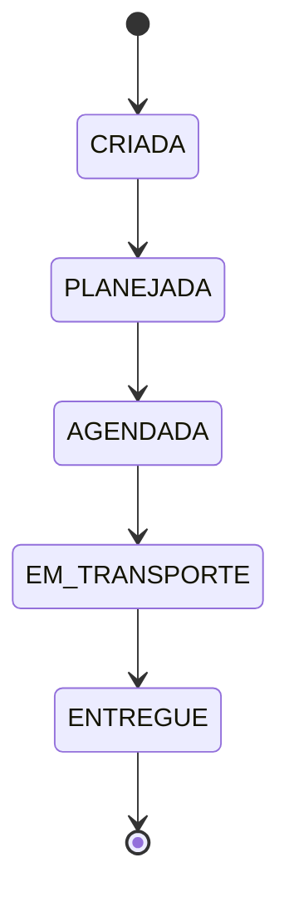

# OVGS — Sales Order Management System (Frontend)

Frontend application for managing the lifecycle of Sales Orders (_Ordens de Venda_), built as part of a technical challenge focused on frontend architecture, state management, and code quality.

## Overview

The system centralizes operations that today are spread across multiple tools:

- Customer registration
- Transport type registration
- Item registration
- Sales Order creation and tracking
- Delivery scheduling
- Audit trail of key changes

> This repository covers only the **frontend** scope of the challenge. The backend API is simulated using **MSW (Mock Service Worker)**.

## Tech Stack

| Category            | Technology                              | Notes                                                           |
| ------------------- | --------------------------------------- | --------------------------------------------------------------- |
| Framework           | Next.js (App Router)                    | SSR-ready, modern routing                                       |
| Language            | TypeScript (strict mode)                | Type-safe domain modeling                                       |
| Styling             | Tailwind CSS                            | Utility-first, consistent design tokens                         |
| Server state        | React Query                             | Caching, refetching, request lifecycle                          |
| Global/UI state     | Redux Toolkit                           | Filters, wizard state, client-side business rules               |
| Async orchestration | Redux Saga                              | Multi-step flows (e.g. scheduling confirmation + audit logging) |
| Forms               | React Hook Form + Zod                   | Validation and controlled forms                                 |
| API mocking         | MSW                                     | Realistic REST simulation at the network layer                  |
| Testing             | Jest + React Testing Library            | Unit and integration tests                                      |
| CI/CD               | Azure DevOps Pipelines                  | Lint → Test → Build                                             |
| Code quality        | ESLint + Prettier + Husky + lint-staged | Enforced automatically on every commit                          |

## Architecture

The project follows a **feature-based structure** (screaming architecture): folders are organized by business domain rather than file type, so the codebase communicates _what the system does_ rather than _what kind of files it has_.

```
src/
  app/                   # Next.js routes (thin routing layer only)
    sales-orders/
    customers/
    transport-types/
    items/
    scheduling/
  features/              # one folder per business domain
    sales-orders/
      components/
      hooks/
      services/
      types.ts
      schemas.ts
    customers/
    transport-types/
    items/
    scheduling/
  shared/                # reusable components, hooks, utils
  lib/
    api/                 # HTTP client + MSW mocks
    store/               # Redux store, slices, sagas
    query/               # React Query client config
```

`app/` stays intentionally thin — pages import and render components from `features/`. This keeps routing and business logic decoupled.

## Sales Order Lifecycle

A Sales Order must follow a strict, linear state machine. Transitions outside this sequence are rejected and handled explicitly in the UI (e.g. disabling invalid actions).



## Business Rules (Frontend Scope)

- A Sales Order can only be created if the selected transport type is authorized for the selected customer.
- A Sales Order must contain at least one previously registered item.
- Status transitions are validated on the client before triggering the corresponding action.

## Domain Modeling

- **Entity types vs. input types**: `features/*/types.ts` models entities as they exist once persisted (including `id`, `createdAt`, etc.). `features/*/schemas.ts` (Zod) models what the user actually submits through a form — a narrower shape, with `id`/timestamps intentionally omitted. Input types are derived from the schemas (`z.infer<typeof schema>`), so validation is the single source of truth for form shapes.
- **Union types over `enum`**: statuses (`SalesOrderStatus`) and fixed values (`DeliveryWindow`) are modeled as string literal unions rather than TypeScript `enum`s, avoiding extra runtime artifacts and integrating cleanly with Zod (`z.enum`).
- **Status transitions as data**: valid transitions live in a single `VALID_STATUS_TRANSITIONS` map, so UI, form validation, and any guard logic all read from the same source instead of duplicating conditionals.

## Architectural Decisions & Trade-offs

- **React Compiler: not enabled.** At this stage, memoization (`useMemo`, `useCallback`, `React.memo`) is handled explicitly rather than relying on automatic compiler optimizations. This keeps rendering behavior predictable while combined with Redux and React Query, both of which already manage their own caching/selector strategies, and demonstrates deliberate performance decisions rather than delegating them to an experimental tool.
- **React Query vs Redux Toolkit split**: server-derived data (orders, customers, items) lives in React Query's cache; UI and cross-cutting client state (filters, scheduling wizard, transition validation) lives in Redux.
- **Cross-entity business rules kept outside static schemas.** The rule "transport type must be authorized for the selected customer" depends on server-fetched state (the customer's authorized list) that a standalone Zod schema has no access to. Rather than forcing this into the schema, it's validated at form-submission time, once the customer data is available via React Query. This keeps schemas pure and side-effect-free.

## Code Quality & Tooling

- **ESLint** — code-quality rules only (`eslint-config-next`, covering React/Next.js/TypeScript best practices).
- **Prettier** — sole source of truth for formatting, including a Tailwind-aware plugin (`prettier-plugin-tailwindcss`) that auto-sorts utility classes into a consistent order. `eslint-config-prettier` disables any ESLint stylistic rule that could conflict with Prettier, so the two tools never fight over the same concern.
- **Husky + lint-staged** — a pre-commit hook runs ESLint (`--fix`) and Prettier against staged files only, so formatting/lint issues never reach a commit.

```bash
npm run lint          # check code-quality rules
npm run format        # format the whole project
npm run format:check  # verify formatting without writing changes
```

## Getting Started

> ⚠️ Setup in progress — instructions will be finalized once dependencies are installed.

```bash
npm install
npm run dev
```

## Testing

```bash
npm test
```

## Status

🚧 Work in progress — this README is being built incrementally alongside development.
