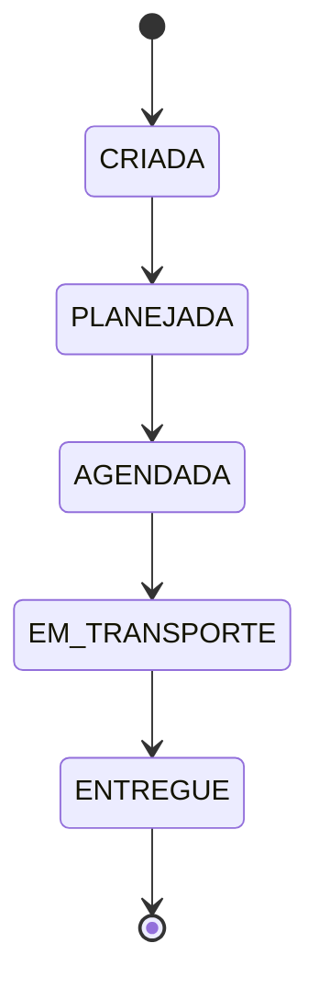

# OVGS — Sales Order Management System (Frontend)

Frontend application for managing the lifecycle of Sales Orders (*Ordens de Venda*), built as part of a technical challenge focused on frontend architecture, state management, and code quality.

## Overview

The system centralizes operations that today are spread across multiple tools:

- Customer registration
- Transport type registration
- Item registration
- Sales Order creation and tracking
- Delivery scheduling
- Audit trail of key changes

> This repository covers only the **frontend** scope of the challenge. The backend API is simulated using **MSW (Mock Service Worker)**.

## Tech Stack

| Category | Technology | Notes |
|---|---|---|
| Framework | Next.js (App Router) | SSR-ready, modern routing |
| Language | TypeScript (strict mode) | Type-safe domain modeling |
| Styling | Tailwind CSS | Utility-first, consistent design tokens |
| Server state | React Query | Caching, refetching, request lifecycle |
| Global/UI state | Redux Toolkit | Filters, wizard state, client-side business rules |
| Async orchestration | Redux Saga | Multi-step flows (e.g. scheduling confirmation + audit logging) |
| Forms | React Hook Form + Zod | Validation and controlled forms |
| API mocking | MSW | Realistic REST simulation at the network layer |
| Testing | Jest + React Testing Library | Unit and integration tests |
| CI/CD | Azure DevOps Pipelines | Lint → Test → Build |

## Architecture

The project follows a **feature-based structure** (screaming architecture): folders are organized by business domain rather than file type, so the codebase communicates *what the system does* rather than *what kind of files it has*.

```
src/
  app/                  # Next.js routes
  features/             # one folder per business domain
    ordens-venda/
    clientes/
    tipos-transporte/
    itens/
    agendamento/
  shared/                # reusable components, hooks, utils
  lib/
    api/                 # HTTP client + MSW mocks
    store/               # Redux store, slices, sagas
    query/                # React Query client config
```

## Sales Order Lifecycle

A Sales Order must follow a strict, linear state machine. Transitions outside this sequence are rejected and handled explicitly in the UI (e.g. disabling invalid actions).



## Business Rules (Frontend Scope)

- A Sales Order can only be created if the selected transport type is authorized for the selected customer.
- A Sales Order must contain at least one previously registered item.
- Status transitions are validated on the client before triggering the corresponding action.

## Architectural Decisions & Trade-offs

- **React Compiler: not enabled.** At this stage, memoization (`useMemo`, `useCallback`, `React.memo`) is handled explicitly rather than relying on automatic compiler optimizations. This keeps rendering behavior predictable while combined with Redux and React Query, both of which already manage their own caching/selector strategies, and demonstrates deliberate performance decisions rather than delegating them to an experimental tool.
- **React Query vs Redux Toolkit split**: server-derived data (orders, customers, items) lives in React Query's cache; UI and cross-cutting client state (filters, scheduling wizard, transition validation) lives in Redux.

## Getting Started

> ⚠️ Setup in progress — instructions will be finalized once dependencies are installed.

```bash
npm install
npm run dev
```

## Testing

```bash
npm test
```

## Status

🚧 Work in progress — this README is being built incrementally alongside development.
