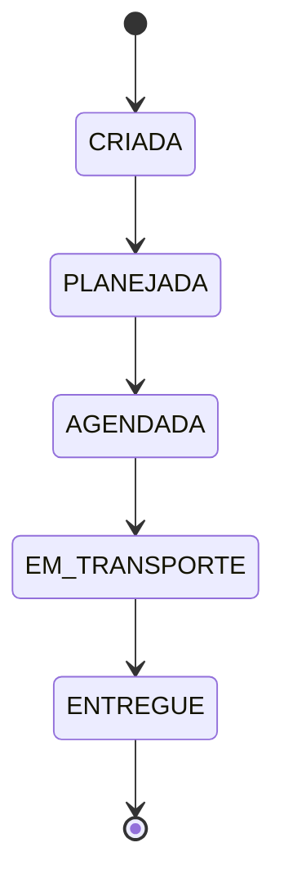

# OVGS - Sales Order Management System (Frontend)

Frontend application for managing the lifecycle of Sales Orders (_Ordens de Venda_), built as part of a technical challenge focused on frontend architecture, state management, and code quality.

## Overview

The system centralizes operations that today are spread across multiple tools:

- Customer registration
- Transport type registration
- Item registration
- Sales Order creation and tracking
- Delivery scheduling
- Audit trail of key changes

> This repository covers only the **frontend** scope of the challenge. The backend API is simulated using **MSW (Mock Service Worker)**.

## Tech Stack

| Category            | Technology                              | Notes                                                           |
| ------------------- | --------------------------------------- | --------------------------------------------------------------- |
| Framework           | Next.js (App Router)                    | SSR-ready, modern routing                                       |
| Language            | TypeScript (strict mode)                | Type-safe domain modeling                                       |
| Styling             | Tailwind CSS                            | Utility-first, consistent design tokens                         |
| Server state        | React Query                             | Caching, refetching, request lifecycle                          |
| Global/UI state     | Redux Toolkit                           | Filters, wizard state, client-side business rules               |
| Async orchestration | Redux Saga                              | Multi-step flows (e.g. scheduling confirmation + audit logging) |
| Forms               | React Hook Form + Zod                   | Validation and controlled forms                                 |
| API mocking         | MSW                                     | Realistic REST simulation at the network layer                  |
| Testing             | Jest + React Testing Library            | Unit and integration tests                                      |
| CI/CD               | Azure DevOps Pipelines                  | Lint → Test → Build                                             |
| Code quality        | ESLint + Prettier + Husky + lint-staged | Enforced automatically on every commit                          |
| UI design system    | Custom Tailwind components              | Material Design-inspired (`shared/components/ui/`)              |

## Architecture

The project follows a **feature-based structure** (screaming architecture): folders are organized by business domain rather than file type, so the codebase communicates _what the system does_ rather than _what kind of files it has_.

```
src/
  app/                   # Next.js routes (thin routing layer only)
    sales-orders/
      page.tsx             # list
      new/page.tsx         # create form
      [id]/page.tsx        # detail + status transitions
    customers/
    transport-types/
    items/
    scheduling/
    monitoring/
  features/              # one folder per business domain
    sales-orders/
      components/
      hooks/
      services/
      store/              # salesOrderFiltersSlice
      constants.ts        # STATUS_LABELS, STATUS_STYLES
      types.ts
      schemas.ts
    customers/
    transport-types/
    items/
    scheduling/
      services/
      store/              # schedulingSlice, schedulingSaga
      types.ts
      schemas.ts
  shared/
    components/ui/        # TextField, Select, Checkbox, Button, Card
    test-utils/           # renderWithQueryClient, renderWithProviders
    store/                # auditSlice (cross-cutting)
    types.ts
  lib/
    api/
      mocks/               # data, handlers, browser, server, MockProvider
      httpClient.ts
    query/                 # queryClient, QueryProvider
    store/                 # store (factory), rootReducer, rootSaga, hooks, StoreProvider
```

`app/` stays intentionally thin - pages import and render components from `features/`. This keeps routing and business logic decoupled.

## UI Design System

A small set of shared, reusable primitives (`shared/components/ui/`) implements a Material Design-inspired look using plain Tailwind utility classes - no component library (e.g. MUI) involved:

- **`TextField` / `Select`** - "outlined" style, label above, primary-colored focus ring, error state in the error color.
- **`Button`** - "filled" (primary CTA, `rounded-full`, elevation grows on hover) and "text" (low-emphasis) variants.
- **`Checkbox`** - Material-style checkbox with a primary accent color.
- **`Card`** - elevated surface (`shadow-sm`, rounded corners) wrapping page content.

Colors are defined as semantic tokens in `globals.css` (`--color-primary`, `--color-on-primary`, `--color-surface`, `--color-on-surface`, `--color-outline`, `--color-error`), not hardcoded Tailwind palette colors - this means the whole app's color scheme can be changed by editing one `@theme` block, and every component reads a _role_ (`bg-primary`, `text-on-surface`) rather than a literal shade.

## Sales Order Lifecycle

A Sales Order must follow a strict, linear state machine. Transitions outside this sequence are rejected and handled explicitly in the UI (e.g. disabling invalid actions).



## State Management

Three tools, three distinct responsibilities - no overlap:

- **React Query** owns server state: sales orders, customers, items, transport types. Fetching, caching, invalidation.
- **Redux Toolkit** owns client/UI state: `salesOrderFilters` (Monitoramento Operacional filters), `scheduling` (confirmation flow status), `audit` (client-visible audit trail).
- **Redux Saga** owns multi-step async orchestration - currently the scheduling confirmation flow: call the API → log an audit event → sync the React Query cache directly → notify the UI. A component only dispatches one intent action (`confirmSchedulingRequested`) and reads back a status (`idle | confirming | confirmed | error`); it knows nothing about the API call, the audit event, or the cache sync happening underneath.
- **`thunk` middleware is disabled** in the store config - Saga is the single async pattern used, avoiding two competing ways to do the same thing.
- The saga imports the `queryClient` singleton directly (not through React Context), so it can update React Query's cache from outside any component - this is also why provider nesting order between `StoreProvider` and `QueryProvider` doesn't matter; only `MockProvider` must stay outermost.

## Business Rules (Frontend Scope)

- A Sales Order can only be created if the selected transport type is authorized for the selected customer.
- A Sales Order must contain at least one previously registered item.
- Status transitions are validated on the client before triggering the corresponding action.

## Domain Modeling

- **Entity types vs. input types**: `features/*/types.ts` models entities as they exist once persisted (including `id`, `createdAt`, etc.). `features/*/schemas.ts` (Zod) models what the user actually submits through a form - a narrower shape, with `id`/timestamps intentionally omitted. Input types are derived from the schemas (`z.infer<typeof schema>`), so validation is the single source of truth for form shapes.
- **Union types over `enum`**: statuses (`SalesOrderStatus`) and fixed values (`DeliveryWindow`) are modeled as string literal unions rather than TypeScript `enum`s, avoiding extra runtime artifacts and integrating cleanly with Zod (`z.enum`).
- **Status transitions as data**: valid transitions live in a single `VALID_STATUS_TRANSITIONS` map, so UI, form validation, and any guard logic all read from the same source instead of duplicating conditionals.

## Architectural Decisions & Trade-offs

- **React Compiler: not enabled.** At this stage, memoization (`useMemo`, `useCallback`, `React.memo`) is handled explicitly rather than relying on automatic compiler optimizations. This keeps rendering behavior predictable while combined with Redux and React Query, both of which already manage their own caching/selector strategies, and demonstrates deliberate performance decisions rather than delegating them to an experimental tool.
- **React Query vs Redux Toolkit split**: server-derived data (orders, customers, items) lives in React Query's cache; UI and cross-cutting client state (filters, scheduling wizard, transition validation) lives in Redux.
- **Cross-entity business rules kept outside static schemas.** The rule "transport type must be authorized for the selected customer" depends on server-fetched state (the customer's authorized list) that a standalone Zod schema has no access to. Rather than forcing this into the schema, it's validated at form-submission time, once the customer data is available via React Query. This keeps schemas pure and side-effect-free.
- **Audit trail is client-side only, not persisted.** Since the backend is out of scope, the `audit` Redux slice keeps an in-memory log of events (e.g. scheduling changes) for display purposes. A real implementation would persist these server-side; this is an explicit simplification, not an oversight.
- **Saga used for orchestration, not for every async call.** Sales order CRUD and simple mutations go through plain React Query `useMutation` hooks - no saga involved. Saga is reserved for flows that genuinely coordinate multiple sequential side effects with one shared error boundary (currently: scheduling confirmation → audit log → cache sync). Introducing a saga for a single API call would just be indirection without benefit.

## Code Quality & Tooling

- **ESLint** - code-quality rules only (`eslint-config-next`, covering React/Next.js/TypeScript best practices).
- **Prettier** - sole source of truth for formatting, including a Tailwind-aware plugin (`prettier-plugin-tailwindcss`) that auto-sorts utility classes into a consistent order. `eslint-config-prettier` disables any ESLint stylistic rule that could conflict with Prettier, so the two tools never fight over the same concern.
- **Husky + lint-staged** - a pre-commit hook runs ESLint (`--fix`) and Prettier against staged files only, so formatting/lint issues never reach a commit.

```bash
npm run lint          # check code-quality rules
npm run format        # format the whole project
npm run format:check  # verify formatting without writing changes
```

## Getting Started

```bash
npm install
npm run dev
```

Open [http://localhost:3000](http://localhost:3000). API calls are intercepted by MSW automatically in development - no separate backend needed.

## Testing

- **Jest** (via `next/jest`, SWC-based, no Babel config needed) + **React Testing Library** + **user-event**.
- **MSW powers both the running app and the tests** - `lib/api/mocks/handlers.ts` is shared by `browser.ts` (dev server) and `server.ts` (`setupServer`, used in tests), so tests exercise the exact same mocked API contract the UI runs against.
- Every test gets its **own `QueryClient`** (`shared/test-utils/renderWithQueryClient.tsx`) - never the app's singleton, to avoid cache bleeding between tests.
- Tests involving Redux/Saga use `renderWithProviders.tsx` instead, which also spins up a **fresh store per test** via a `createAppStore()` factory (rather than the app's singleton). Every saga task it starts is tracked and explicitly **cancelled in `afterEach`** (`jest.setup.ts`) - an uncancelled saga keeps running after its test ends, which can leak into later tests and leave Jest workers hanging.
- `onUnhandledRequest: "error"` in tests (stricter than the app's `"bypass"`) - a test silently passing against a real network call is worse than a loud failure telling you an endpoint wasn't mocked.

**A few testing patterns worth following consistently:**

- For any element that depends on async data (React Query), use `findBy*` (waits) rather than `getBy*` (fails immediately) - and never cache a queried element across an action that can cause it to unmount/remount (e.g. a filter change triggering a new loading state); re-query fresh inside each `waitFor` instead.
- `getAllByText`/`getByText` can match unintended elements if the same text also appears elsewhere on screen (e.g. inside an unrelated `<option>`); scope the query with `within(container)` when that's a risk.
- `<input type="date">` (and other specialized input types) don't work reliably with `userEvent.type()` - use `fireEvent.change(input, { target: { value } })` instead.

```bash
npm test            # run all tests
npm run test:watch  # watch mode
```

### jsdom + MSW v2 polyfill setup

Jest's `jsdom` environment doesn't implement the Fetch API (`Request`/`Response`/`fetch`) or a few other Node/Web globals that MSW's Node interceptors depend on. Getting this combination running requires a dedicated polyfill file, loaded _before_ the test environment via `setupFiles` (not `setupFilesAfterEnv`):

- `jest.polyfills.js` defines `TextEncoder`/`TextDecoder`, `ReadableStream`/`TransformStream`/`WritableStream`, `MessageChannel`/`MessagePort`, `BroadcastChannel`, and `fetch`/`Request`/`Response`/`Headers`/`FormData` (the last group sourced from `undici`, in the correct order - the stream/message globals must exist _before_ `undici` is required, since its fetch implementation reads them at import time).
- Every defined property uses `configurable: true`. Without it, MSW's own interceptors fail with `Cannot redefine property` the moment they try to patch these same globals again - a fetch/Request polyfill that can't later be redefined defeats the purpose of an interceptor.
- `jest.config.mjs` sets `transformIgnorePatterns: []` (transforms everything, including `node_modules`) because MSW ships several ESM-only internal dependencies (`@mswjs/interceptors`, `rettime`, and others); allow-listing them one at a time as errors surfaced proved slower than just transforming everything - a negligible performance cost for this project's test suite size.

## Implementation Status

Mapped against the challenge's own functional requirements:

**Gestão de Ordens de Venda** - ✅ Done
Create, list, detail view, and status transitions (respecting the state machine) are all implemented at `/sales-orders`, `/sales-orders/new`, `/sales-orders/[id]`.

**Monitoramento Operacional** - ✅ Done
Filters by status, customer, transport type, and date at `/monitoring`, backed by `salesOrderFiltersSlice` (Redux) + `useSalesOrders(filters)` (React Query).

**Central de Agendamento** - ✅ Done
Scheduling confirmation/reschedule at `/scheduling`, orchestrated end-to-end by `schedulingSaga`.

**Cadastros:**

- Tipos de Transporte (Criar/Editar/Consultar) - ✅ Done, at `/transport-types`.
- Clientes - ⚠️ **Partial.** Only "Criar" has a screen (`/customers`). "Editar" and "Consultar" (a list view) are not yet built - `useCustomers`/`useCreateCustomer` exist, but no `useUpdateCustomer` hook or list screen yet.
- Itens - ⚠️ **Partial.** Only "Criar" has a screen (`/items`). "Consultar" (a list view) is not yet built - `useItems` already exists and would only need a list component analogous to `TransportTypeList`.

**Auditoria** - ⚠️ **Partial.** Events are logged to the `audit` Redux slice on scheduling changes, but there's no dedicated screen to view the trail yet.

**Tests** - ✅ Done, exceeds the minimum (2 unit + 1 integration required; this project has significantly more, spread across every feature).

**CI/CD (Azure DevOps)** - ❌ Not started.

## Status

🚧 Work in progress - this README is being built incrementally alongside development.
